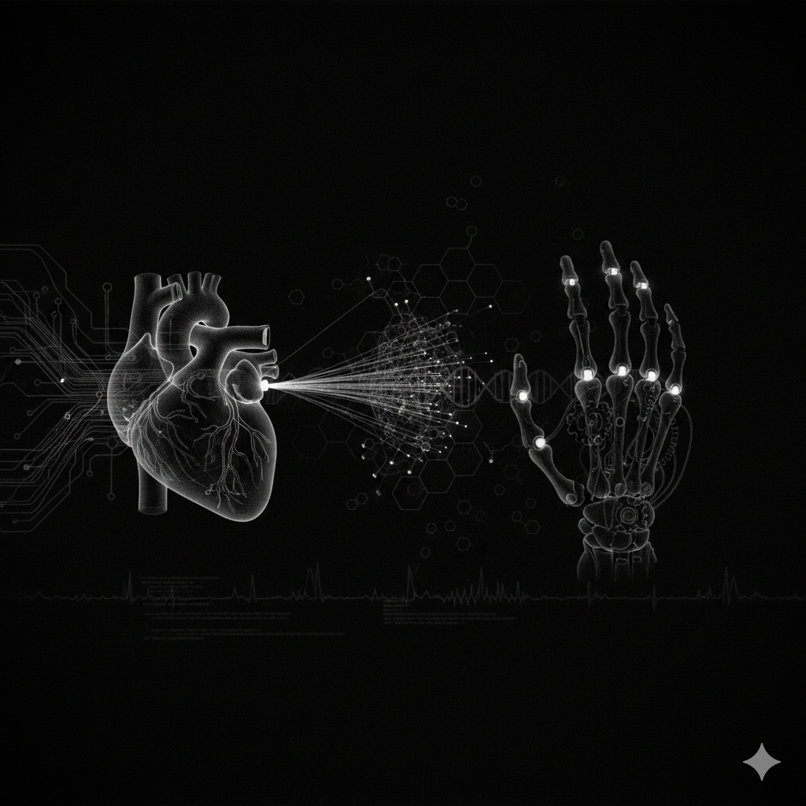

# 👨‍⚕️ Manoj V - Biomedical Engineer Portfolio


> **"Bridging the gap between engineering and healthcare."**

This repository contains the source code for my personal portfolio website. It serves as a digital resume and showcase for my work in **Biomedical Engineering**, **Embedded Systems**, and **Medical IoT**. The site is designed with a modern, responsive interface featuring a custom dark/light theme switcher.

---

## 📸 Screenshots

| **Dark Mode (Default)** | **Light Mode** |
|:---:|:---:|
|  |  |

---

## 🚀 Features

* **🎨 Dynamic Theme Switcher**: Users can toggle between a "Hacker-style" Dark Mode (Red/Grey/Black) and a clean Light Mode. Preference is saved to local storage.
* **📱 Fully Responsive**: Optimized for desktops, tablets, and mobile devices using CSS Grid and Flexbox.
* **✨ Interactive Animations**: Smooth scroll-triggered animations (Fade-in-Up, Staggered lists) powered by `IntersectionObserver`.
* **📄 Integrated Resume**: Direct access to view or download my CV (`MANOJ_V.pdf`).
* **⚡ Performance**: Built with Vanilla JavaScript (No heavy frameworks) for maximum speed and lightweight loading.

## 🛠️ Tech Stack

* **Frontend**: Semantic HTML5, CSS3 (Custom Variables/Properties)
* **Scripting**: Vanilla JavaScript (ES6+)
* **Design**: Custom "Inter" font typography, HSL color system for easy theming.
* **Icons**: SVG Icons (Feather Icons style)

---

## 📂 Portfolio Sections

1.  **Home**: Brief introduction and profile highlights.
2.  **About**: Career objectives focusing on Field Service, Calibration, and Quality Checking in healthcare.
3.  **Experience**: Timeline of my internships and training at:
    * *Chennai National Hospital* (Trainee)
    * *KV's Biomedical* (Industrial Systems)
    * *Peacock Hospitals Pvt Ltd* (ER/OT Maintenance)
4.  **Skills**: Categorized into Tool-based (Matlab, KiCad), Technical (Embedded Systems, Linux), and Soft Skills.
5.  **Projects**: Highlights of my academic and hackathon achievements:
    * *Smart Device for Legacy Medical Devices* (Smart India Hackathon Top 3)
    * *Myo-electric Prosthetic Hand*
    * *IoT Based IV Bag Monitoring System*

---

## 🔧 Setup & Usage

To run this project locally on your machine:

1.  **Clone the repository**:
    ```bash
    git clone [https://github.com/ManoMedEngg/Profilo.git](https://github.com/ManoMedEngg/Profilo.git)
    ```
2.  **Navigate to the directory**:
    ```bash
    cd Profilo
    ```
3.  **Open the file**:
    Simply open `index.html` in your preferred web browser.

*Note: For the best experience, use a live server extension (like in VS Code) to ensure all assets load correctly.*

---

## 👨‍💻 About Me

I am a **Biomedical Engineering graduate** passionate about improving patient care through technology. With hands-on experience in hospital equipment management, calibration, and embedded systems, I aim to ensure medical devices operate safely and effectively.

* **Location**: Nemili, Ranipet, India
* **Interests**: Medical IoT, Prosthetics, PCB Design, Hospital Equipment Maintenance.

---

## 📬 Contact

Feel free to reach out for collaborations or opportunities!

<a href="https://linkedin.com/in/manojvenu" target="blank"></a> <a href="mailto:manojvenu23@gmail.com" target="blank"></a> <a href="https://discord.gg/mano_medengg" target="blank"></a> <a href="https://www.reddit.com/user/Miserable_Shape_9110/" target="blank"></a>

---

## 📄 License

This project is licensed under the **GNU General Public License v3.0**. See the [LICENSE](LICENSE) file for details.
